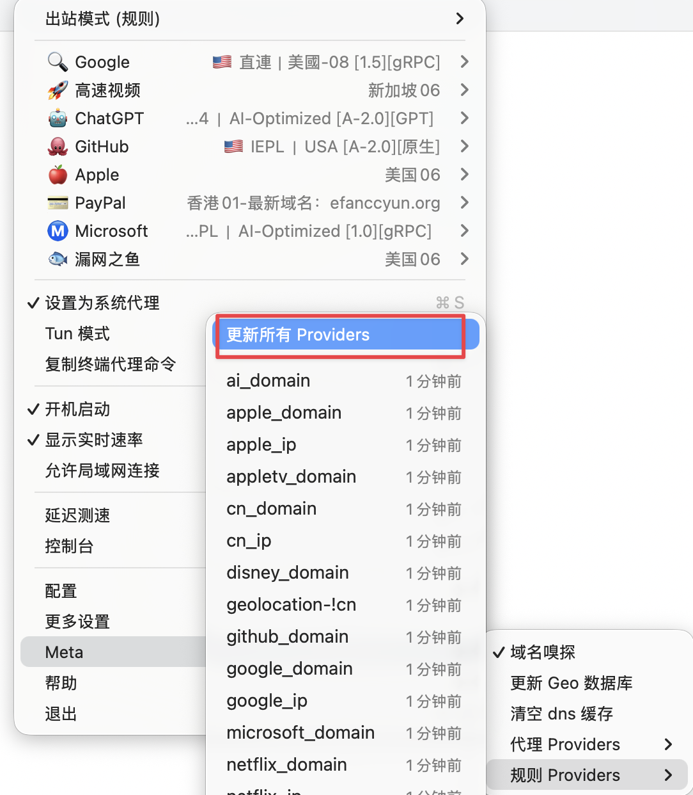

# 🌐 Cloud-Native Network Infrastructure (Mihomo/Clash Meta)

这是基于 Clash Meta (Mihomo) 内核构建的高度自动化分流方案。

# 🚀 3 分钟上手（从 clone 到可用）

1. `git clone` 本项目。
2. 打开 `combined.yaml`，找到 `proxy-providers`，把订阅链接替换成你自己的。
3. 按需调整 `proxy-groups`（节点如何分组）与 `rules`（如何分流）。
4. ClashX Meta → 配置 → 打开配置文件夹，把 `combined.yaml` 放进去。
5. ClashX Meta → 选择配置 `combined`。
6. ClashX Meta → Meta → 代理 Providers → 更新全部。
7. ClashX Meta → Meta → 规则 Providers → 更新全部。

Maintenance: 改动 `combined.yaml` 后，请在 UI 中更新 Providers 以触发 MRS 规则集下载。

# 🏗️ 配置核心逻辑指南

本仓库的配置文件遵循 “解耦 -> 筛选 -> 调度” 的模块化设计方案。

## 1. 节点引入 (Proxy Providers)

通过 `proxy-providers` 实现订阅地址与主配置的解耦，支持自动更新与本地缓存。

配置要点：
- `type: http`: 远程获取订阅。
- `path`: 必须设置，确保断网或机场维护时仍有本地缓存可用。
- `health-check`: 建议开启，用于自动剔除失效节点。

```yaml
proxy-providers:
  provider_a:
    type: http
    url: "你的订阅链接"
    interval: 3600
    path: ./provider_a.yaml
    health-check:
      enable: true
      interval: 600
      url: http://www.gstatic.com/generate_204
  provider_b:
    type: http
    url: "你的订阅链接"
    interval: 3600
    path: ./provider_b.yaml
    health-check:
      enable: true
      interval: 600
      url: http://www.gstatic.com/generate_204
```

### 如何新增一个 Provider
步骤：
1. 在 `proxy-providers` 下新增一个条目，起一个唯一的名称（例如 `provider_c`）。
2. 复制现有 provider 的结构，替换 `url` 和 `path`。
3. 到 `proxy-groups` 里把新 provider 加到 `use: [...]` 中，或为它新建分组。

示例：
```yaml
proxy-providers:
  provider_c:
    type: http
    url: "你的订阅链接"
    interval: 3600
    path: ./provider_c.yaml
    health-check:
      enable: true
      interval: 600
      url: http://www.gstatic.com/generate_204

proxy-groups:
  - name: "🧩 新节点组"
    type: select
    use: [provider_c]
```

## 2. 策略分组 (Proxy Groups)

利用正则表达式 (`filter`) 实现节点的自动化清洗，无需手动维护繁琐的节点列表。

配置要点：
- `type: select`: 手动选择，适合归属地敏感业务（Gemini/AI）。
- `type: url-test`: 自动优选，适合大流量业务（视频/下载）。
- `filter`: 使用正则匹配关键字，如 `(?i)美国|US` 自动抓取美国节点。

### 新增或修改 Proxy Groups
步骤：
1. 复制一个现有组，改 `name`（必须唯一）。
2. 选择 `type`（`select` 手动/`url-test` 自动测速/`fallback` 主备/`load-balance` 负载）。
3. 用 `use` 指向需要的 provider（如 `provider_a` / `provider_b`）。
4. 需要筛选时加 `filter`；不需要就留空或注释掉。

示例：新增一个“日本自动测速组”
```yaml
proxy-groups:
  - name: "🇯🇵 日本自动"
    type: url-test
    use: [provider_a]
    filter: "(?i)日本|JP|Tokyo|Osaka"
```

示例：修改现有组（只替换筛选条件）
```yaml
proxy-groups:
  - name: "🚀 高速视频"
    type: select
    use: [provider_b]
    filter: "(?i)香港|新加坡|HK|SG|IEPL|IPLC"
```

示例：入口组通过 `proxies` 引用其他组
```yaml
proxy-groups:
  - name: "🚀 一键代理"
    type: select
    proxies: ["🔍 Google", "🤖 ChatGPT", "🚀 高速视频", "🐟 漏网之鱼"]
```

### `filter` 使用教程（节点名正则）
`filter` 会对“节点名称”做正则匹配，命中即加入该策略组。常用写法：

**1) 基础匹配（国家/地区）**
```yaml
filter: "(?i)香港|HK|Hong Kong"
```

**2) 多条件合并（OR）**
```yaml
filter: "(?i)日本|JP|Tokyo|Osaka"
```

**3) 排除关键词（NOT）**
使用“先全量匹配，再排除”的写法：
```yaml
filter: "(?i)^(?!.*(专线|IPLC)).*(美国|US|USA).*"
```

**进阶匹配（业务标签/前后缀）**
```yaml
filter: "(?i)(Netflix|NF|解锁)"
filter: "^(?i)US-"
```

**小贴士**
- `(?i)` 表示忽略大小写。
- 关键字之间用 `|` 代表“或”。
- 复杂正则仅在必要时使用。

### Proxy Groups 速查（字段与排错）
**字段速查**
- `name`: 组名，必须唯一。
- `type`: 选择方式（`select`/`url-test`/`fallback`/`load-balance`）。
- `use`: 引用哪些 `proxy-providers`。
- `filter`: 节点名正则筛选（可选）。
- `proxies`: 引用其他组或节点（用于组嵌套）。

**常见问题**
- 组里没有节点：检查 `filter` 是否过严，或 provider 名称是否正确。
- 节点很多但选不到：优先用 `use` + `filter`，避免全量加入。

## 3. 分流调度 (Rules)

遵循 “从上到下，首位命中” 的阶梯式原则。

书写规范：
- 私有流量 (L1)：`private_ip` / `private_domain` 必须置顶，确保局域网与本地开发环境直连。
- 核心服务 (L2)：针对 Google、GitHub、AI 等进行定向分流。
- 区域分流 (L3)：利用 `geolocation-!cn` 自动接管所有未点名的海外流量。
- 兜底放行 (L4)：国内域名 (`cn_domain`) 直连，最后由 `MATCH` 捕获残余流量。

### 怎么改 / 怎么扩展
**1) 调整优先级**
- 规则从上到下依次命中，想“更优先”就往上移。
- `MATCH` 永远放最后。

**1.1) 规则写法速查**
```yaml
- RULE-SET,google_domain,🔍 Google
- RULE-SET,youtube_domain,🚀 高速视频
```

**2) 新增某个服务**
先在 `rule-providers` 里添加对应的规则集（`RULE-SET` 来源），再在 `rules` 里插入一行即可：
```yaml
- RULE-SET,telegram_domain,📨 Telegram
```

**3) 添加自定义直连/代理**
临时规则可以直接写在 rules 里：
```yaml
- DOMAIN-SUFFIX,example.com,DIRECT
- DOMAIN-KEYWORD,openai,🚀 一键代理
```

**4) no-resolve 使用建议**
- IP 类规则（`IP-CIDR` / `RULE-SET` 的 IP 列表）建议加 `no-resolve`，提升性能。
- 域名类规则不需要 `no-resolve`。

**5) 规则调整建议**
- 新业务优先放在同类规则上方，避免被更粗的规则吞掉。
- 规则命中不对时，先检查是否被更高优先级的规则拦截。

```yaml
rules:
  - RULE-SET,private_ip,DIRECT,no-resolve  # 优先级最高：内网放行
  - RULE-SET,google_domain,🔍 Google       # 精准打击：特种业务
  - RULE-SET,geolocation-!cn,🚀 一键代理   # 区域过滤：海外长尾
  - MATCH,🐟 漏网之鱼                      # 最终兜底：万能捕蚊灯
```

# 🖼️ 参考截图（ClashX Meta）



